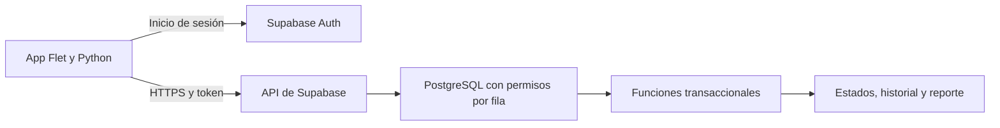

# Arquitectura y herramientas

## Decisión propuesta

**Cliente móvil Flet con Python y Supabase para autenticación y PostgreSQL en la nube. Android primero**, coherente con el teléfono del presupuesto. Sustituye la recomendación preliminar de Django/web porque la propuesta exige un prototipo móvil. La decisión se consolida tras una prueba temprana de empaquetado y accesibilidad.

Flet permite generar APK desde Windows, Linux o macOS. Paquetes Python con componentes nativos requieren compatibilidad Android: mantener pocas dependencias y probarlas antes de ampliar el cliente. [Flet Android](https://flet.dev/docs/publish/android/).

No se necesita un servidor Python propio inicialmente. Python implementa interfaz y validaciones de uso; SQL aplica reglas persistentes que no se pueden confiar al cliente. Supabase no aloja arbitrariamente un servidor Django/FastAPI. Una API Python propia sería una evolución si nuevas integraciones justifican su alojamiento y mantenimiento.

## Datos y seguridad

Tablas propuestas: perfiles vinculados a Auth, beneficiarios, vínculos familiares, acompañantes, solicitudes, eventos y reportes. Modalidad del plan de demostración hasta cerrar reglas comerciales. Solicitud identifica solicitante, beneficiario, acompañante, fecha/hora con zona, diligencia y puntos de encuentro/destino. No recolectar historia clínica para estos flujos.

Activar permisos por fila (RLS) en toda tabla expuesta. Familia accede a sus beneficiarios autorizados; acompañante a sus asignaciones; operador posee rol administrado en entorno confiable. Nadie puede elevar su rol desde el cliente. Los vínculos no se autorizan por conocer un ID.

Funciones transaccionales para asignar, iniciar y completar: comprobar actor y estado previo, evitar doble asignación y registrar evento y reporte final atómicamente. Reporte único por servicio. El cliente no puede escribir directamente un historial confiable ni editar el estado para eludir estas reglas.

Clave publicable y sesión de usuario en cliente; nunca service_role ni contraseña de base de datos. Probar políticas también con peticiones directas a la API. [RLS de Supabase](https://supabase.com/docs/guides/database/postgres/row-level-security).

## Prueba de viabilidad y verificación

En S7–S8 generar e instalar APK mínimo, comprobar texto ampliado, lector de pantalla, navegación, teclado y consulta autenticada. Si accesibilidad o empaquetado fallan, documentar el resultado y evaluar Flutter/Dart para interfaz conservando la nube. Funcionar en escritorio no demuestra compatibilidad móvil.

Pruebas críticas: dos familias aisladas, acompañante sin asignación, transición inválida, doble toque, pérdida de red, sesión vencida, reinicio y reporte único. Ante error de guardado no mostrar éxito. No se promete operación sin conexión.

## Herramientas y costo

Supabase Free, previsto por el presupuesto, incluye actualmente 500 MB de base de datos, 1 GB de archivos y 50.000 usuarios activos mensuales; pausa tras una semana inactiva y no incluye copias automáticas. Preparar exportación controlada y verificar disponibilidad antes de demostraciones. [Condiciones consultadas el 7 de septiembre de 2026](https://supabase.com/pricing).

Colab sirve para aprender Python, analizar resultados anonimizados y experimentar. Sus sesiones y recursos limitados lo hacen inadecuado como servidor permanente. [FAQ de Colab](https://research.google.com/colaboratory/faq.html).

En local: Git, entorno Python aislado y herramientas de empaquetado Android. VS Code es opcional. Codex ayuda a editar y verificar; GitHub almacena las versiones enviadas. Usar Codex para programar no exige añadir IA al producto.

Para iPhone, compilación y simulador Flet requieren macOS; distribución exige configuración de firma. Mac y distribución iOS no figuran en el presupuesto. Android es la entrega base propuesta; iOS depende de equipo y tiempo. [Flet iOS](https://flet.dev/docs/publish/ios/).

No se han instalado SDK móviles, creado proyecto Supabase ni contratado servicios. Revisar cualquier costo nuevo de Codex, tiendas o mensajería antes de incorporarlo al presupuesto.

## Organización futura

`app/` pantallas, `domain/` validaciones, `services/` acceso a nube, `supabase/migrations/` esquema y políticas, `tests/` pruebas, `docs/` evidencia. Versionar migraciones, nunca secretos o datos privados. Fijar versiones de dependencias después de la prueba de empaquetado.
